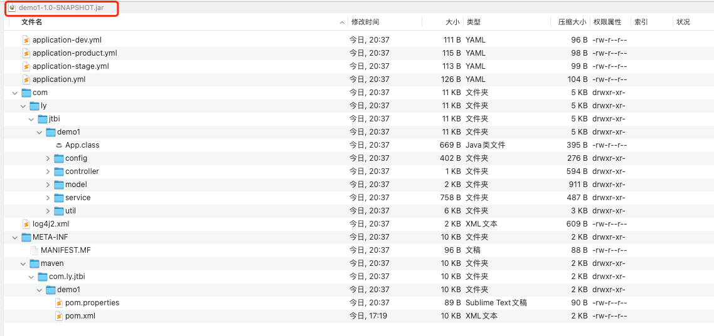
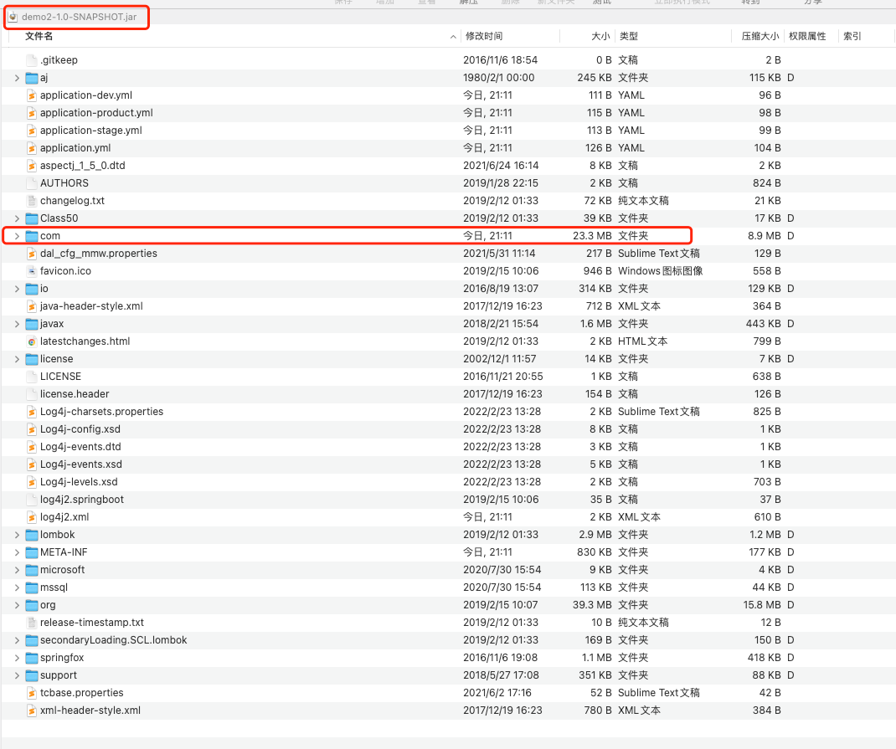
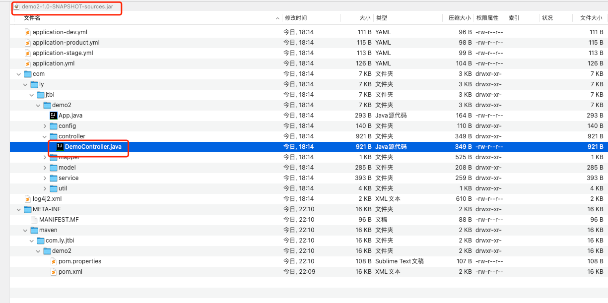
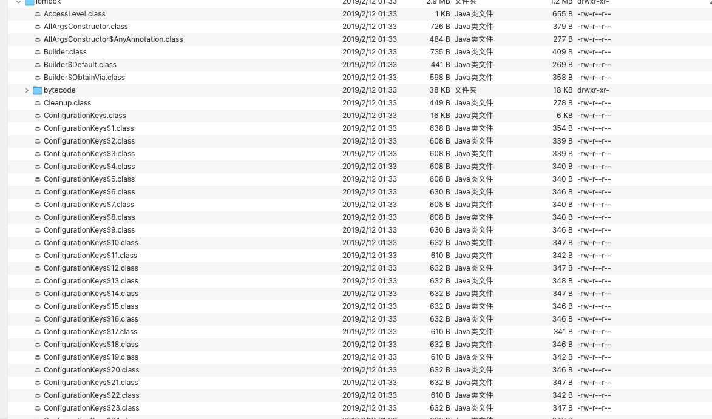
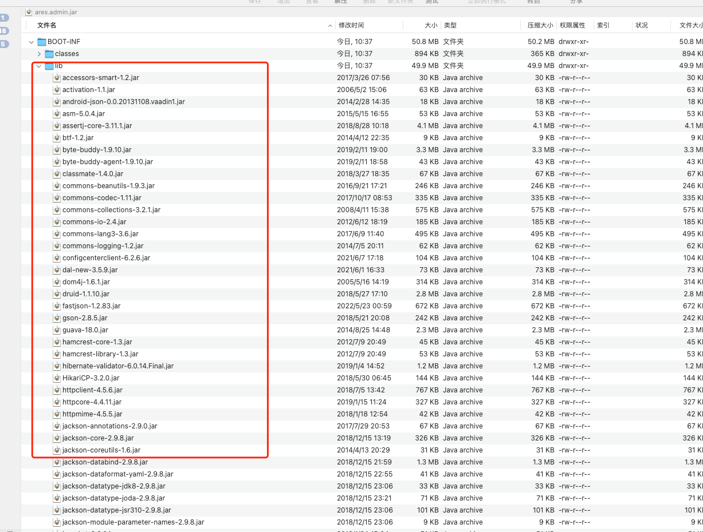

## Maven插件学习
* 之前学习了maven archetype，并且对archetype进行了一个开发实践。现在再去深入去学习maven的插件机制。maven的核心就是插件机制。

## 从maven官网学习
* maven的核心是插件。插件的目的是执行生命周期中的阶段。maven最伟大的内容是抽象出来一套生命周期。在maven的官网是分为两类插件：
    * Build plugins
    * Reporting plugins
    
* maven本质上就是一个插件执行框架。不同的插件含有不同的任务。当执行插件时，实际上执行的是插件的目标。也就是goal.
  * maven插件通常是提供一组目标。其插件执行的语法是
  > mvn [pluginname]: [goal-name]
  * 举个例子就是：mvn compiler:compile
  
* 前边也提到，maven是两类插件，一类是build plugin,一类是resorting plugin.
* mvn带有默认的插件。,证据在这。
* 之前有个小疑问，一直没有解决掉。先来问一个问题哈。我们知道mvn的生命周期中有一个invalite phase.真正有执行过mvn invalite的嘛？还是默认的认为mvn install 会走invalite?
  * 没理解这个问题，说明对于mvn的生命周期概念、插件、插件的执行目的三个概念没有理解清楚。接下来一一解释一下哈。
  * Lifecycle,生命周期是maven抽象出来的概念。其需要具体的实现才能真正的执行。
  * Plugin,插件，插件的目的就是实现生命周期中定义的概念，或者是操作。
  * Plugin Goal,也就是插件目标。一个插件是存在多个插件目标的，为什么要存在多个目标呢？ 官方的说法是为了实现复用，实际上是扩展更加丰富的功能的。
    
## maven的打包方式
* 重点学习一下mvn package. 关于build lifecycle的其他phase.也来简单说一下哈。
  * validate:是校验阶段，是为了去验证项目是否是正确的。这个应该是要去绑定指定的校验插件，目前好想是没有提供默认的校验插件。
  * process-resource:将resource内容copy到target当中。
  * compile:这个插件比较受约束。原因是因为maven只负责java项目，这里的compile也就是是负责java --> classes的过程。compile的执行目标有三个：
    * compiler:compile
    * compiler:help
    * compiler:testCompile
* 重点是来学习一下maven package.这篇文章很是不错，[Maven Packaging Types](https://www.baeldung.com/maven-packaging-types) 我们随着这篇文章，来深入了解一下maven package
  * maven pom.xml <packageing>标签 主要有以下几种类型：
    * jar
    * war
    * pom
    * maven-plugin
    * zar、rar、zip等等
    * .....
  * 实际上常用的就是jar 和 war,还有就是；
  * jar插件有三个goals:
    * jar:jar
    * jar:help
    * jar:test-jar
  * 接下来的phase是install:install是指将artifact包安装到本地仓库。
  * 最后一个是phase是deploy,deploy的目的是将artifact部署到远程仓库。
  
### Maven不同的打包方式，以打jar包为例
* maven打包方式是分为四种。jar、shade、assembly、source.使用不同的插件，得到不相同的jar.
  * 打jar包，maven打jar包和传统上所说的打jar包是不一样的。maven-jar-plugin打包，仅仅是将class文件进行打包，这里不包含依赖的jar包。不是可执行的jar包，因为没有依赖。
    * 这里其实又发现了自己的一个问题。 
    > mvn clean jar:jar 
    > mvn clean package
    * 上述两个命令有啥不一样的？先说第二个，第二个是在执行mvn的生命周期，package，其实是执行的default生命周期，是从validate phase --> package phase。
    * 但是，第一个命令是执行jar插件的jar goal.也仅仅是执行jar插件的jar goal。不存在执行其他的生命周期阶段。
    * 记住打jar包，仅仅是将java --> class，不会去导入依赖的，所以这里生成的jar包就比较小。
    * 
  * 在使用maven-shade-plugin插件打包的时候，还遇到了一个小插件。即，自己在项目中明明是配置了maven-shade-plugin插件，但是在执行mvn clean package时不生效，还是走的default-jar.
    * 具体的原因就是自己没有将<pluginsManagement>的插件 和 <plugins>的区别搞清楚，后续会把这块的东西搞明白的。
    * 在使用maven-shade-plugin打包插件时，打出来的jar是长这个样子的：
      * 
      * 这个jar包就是将所有的jar依赖都打进去的。在使用shade-plugin实际上还存在众多的配置。这里暂且不学习。[配置文件在这个](https://maven.apache.org/plugins/maven-shade-plugin/examples/resource-transformers.html)
  * 第三个是maven-assembly-plugin，这个插件好像日常见的比较多。  
    * maven-shade-plugin 和 maven-assembly-plugin在打包时，都可以将依赖都jar包生成到最后都jar文件当中去。
    * assemblu-plugin日常使用较多。但是，现在晚上有点不想看了。
  * 还有一种打包方式，是source,即就是将源码进行打包。使用maven-source-plugin打包最终的结果如下：
    * 
    * 注意看，这里最终生成的是.java文件。
  

## 疑问
* 之前在使用ares-admin时，执行mvn clean package，在target目录下会存在三个jar包。这三个包分别是什么内容，分得清楚的吗？
  * 从大小来看，original,这个是将源码进行打包，不包含依赖项；
  * dependencies.jar这个是最大，这个是将所有的依赖项打包，这里的依赖项不是.jar的形式哦，而是字节码的形式。
  * 中间那个admin.jar,这个是将所有的jar的依赖项导入的。
  
  
  

## 引用
* https://www.baeldung.com/maven-packaging-types
* https://maven.apache.org/pom.html
* https://maven.apache.org/plugins/maven-assembly-plugin/